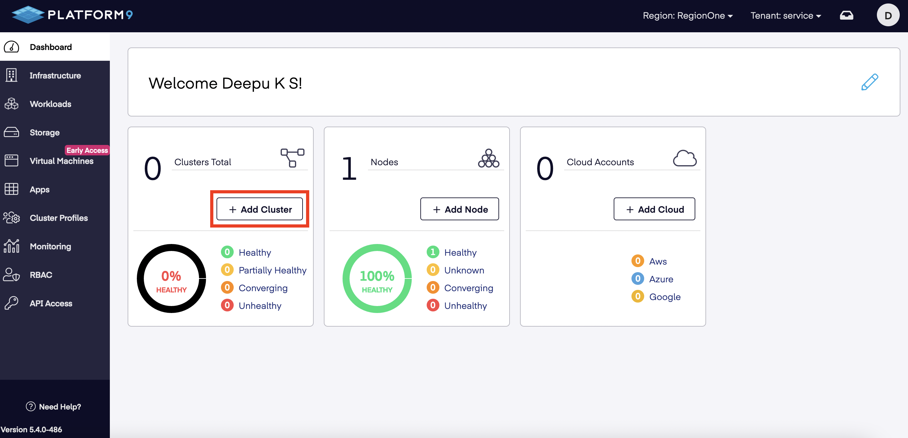
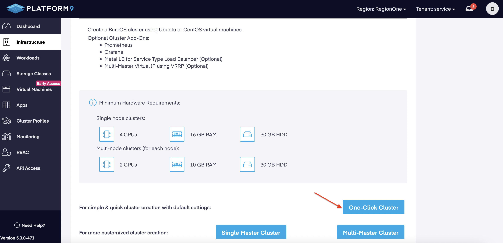

## Deploy a Platform9 Managed Kubernetes cluster and connect it to Azure Arc

The following document will guide on how to deploy a Kubernetes cluster with [Platform9 Managed Kubernetes (PMK)](https://platform9.com/managed-kubernetes/) and have it as a connected Azure Arc Kubernetes resource.
With PMK, you can have your clusters deployed on-premises, in public clouds or at the edge. In this document, we'll explain the steps on how to create an On-premise [BareOS](https://platform9.com/docs/kubernetes/bareos-what-is-bareos) cluster using PMK and connect it to Microsoft Azure Arc.

## Prerequisites

* A working KUBECONFIG file and the [kubectl](https://platform9.com/learn/kubectl) exe for cluster management locally.

  *All PMK cluster nodes would have these installed. If using a different host for managing the cluster, you would require to export the "kubeconfig".yaml path to KUBECONFIG variable or save it to /$HOME/.kube/config .* 

* [Azure CLI (az)](https://docs.microsoft.com/en-us/cli/azure/install-azure-cli?view=azure-cli-latest) version 2.15.0 and above. This cli tool would help to setup the Azure resources and connect the Kubernetes cluster to Azure Arc.

* [Helm](https://helm.sh/docs/intro/install/) version 3+ , to install the Azure Arc agents on the cluster.

* [Enable subscription](https://docs.microsoft.com/en-us/azure/azure-resource-manager/management/resource-providers-and-types#register-resource-provider) with the two resource providers for Azure Arc-enabled Kubernetes.

  ```shell
  az provider register --namespace Microsoft.Kubernetes
  az provider register --namespace Microsoft.KubernetesConfiguration
  az provider register --namespace Microsoft.ExtendedLocation
  ```

  Registration is an asynchronous process, and registration may take approximately 10 minutes. You can monitor the registration process with the following commands

  ```shell
  az provider show -n Microsoft.Kubernetes -o table
  az provider show -n Microsoft.KubernetesConfiguration -o table
  az provider show -n Microsoft.ExtendedLocation -o table
  ```

* Install the Azure Arc Kubernetes CLI extensions *connectedk8s* and *k8s-configuration* .

  ```shell
  az extension add --name connectedk8s
  az extension add --name k8s-configuration
  ```

  Run below command to verify that it is installed.

  ```shell
  az extension list -o table
  ```

* Create Azure service principal (SP)
  To be able to complete the scenario and its related automation, Azure service principal assigned with the “Contributor” role is required.

  For creating the service principal, first login to your Azure account.

  ```shell
  az login
  To sign in, use a web browser to open the page https://microsoft.com/devicelogin and enter the code XXXXXXXXX to authenticate.
  ```

  Login by opening the page on browser and enter the code.

  Post successful authentication, a sample output would like below;

  ```shell
    [
    {
        "cloudName": "AzureCloud",
        "homeTenantId": "xxxxxxxx-xxxx-xxxx-xxxx-xxxxxxxxxxxx",
        "id": "xxxxxxxx-xxxx-xxxx-xxxx-xxxxxxxxxxxx",
        "isDefault": true,
        "managedByTenants": [],
        "name": "Platform9-test",
        "state": "Enabled",
        "tenantId": "xxxxxxxx-xxxx-xxxx-xxxx-xxxxxxxxxxxx",
        "user": {
        "name": "admin@mydomain.example.com",
        "type": "user"
        }
    }
    ]
  ```

  Once succeeded, create the Azure service principal (SP).

  ```shell
  az ad sp create-for-rbac -n "<service-principal-name>" --role contributor
  ```

  Below is an example of creating a service principal.

  ```shell
  az ad sp create-for-rbac -n "platform9-AzureArcK8s" --role contributor
  Creating 'contributor' role assignment under scope '/subscriptions/576a4e39-4a73-4699-bafe-0093c02c336e'
  The output includes credentials that you must protect. Be sure that you do not include these credentials in your code or check the credentials into your source control. For more information, see https://aka.ms/azadsp-cli
  'name' property in the output is deprecated and will be removed in the future. Use 'appId' instead.

  {
    "appId": "xxxxxxxx-xxxx-xxxx-xxxx-xxxxxxxxxxxx",
    "displayName": "platform9-AzureArcK8s",
    "name": "xxxxxxxx-xxxx-xxxx-xxxx-xxxxxxxxxxxx",
    "password": "XXXXXXXXXXXXXXXXXXXXXXXXXXXXXXXX",
    "tenant": "xxxxxxxx-xxxx-xxxx-xxxx-xxxxxxxxxxxx"
  }
  ```

  *Note : It is highly recommended to scope the service principal to a specific [Azure subscription and resource group](https://docs.microsoft.com/en-us/cli/azure/ad/sp?view=azure-cli-latest) as well considering using a [less privileged service principal account](https://docs.microsoft.com/en-us/cli/azure/ad/sp?view=azure-cli-latest).*

* Create a new Azure resource group where you want the PMK cluster to show up.

  ```shell
  az group create -l <Azure Region> -n <resource group name>
  ```

  Below is an example of creating a resource group.

  ```shell
  az group create -l eastus -n Platform9-Arc-k8s-Clusters

  
  Output :
    {
    "id": "/subscriptions/576a4e39-4a73-4699-bafe-0093c02c336e/resourceGroups/deepuks-Arc-k8s-Clusters",
    "location": "eastus",
    "managedBy": null,
    "name": "Platform9-Arc-k8s-Clusters",
    "properties": {
        "provisioningState": "Succeeded"
    },
    "tags": null,
    "type": "Microsoft.Resources/resourceGroups"
    }
  ```

  *If you have an existing resource group, it can be used instead of creating a new one. Mention that to the resourceGroup in the environment variables.*

## Deployment

* Create a [PMK cluster](https://platform9.com/learn/learn/get-started-bare-metal) .

  The cluster creation is done from the PMK Management Plane UI. If you do not have a registered Management Plane with Platform9, you can create one easily using [PMK Free Tier deployment](https://platform9.com/managed-kubernetes/)

  For a BareOS cluster, you will need to have the nodes registered with the PMK Management Plane on which the cluster is to be deployed. A *pf9ctl* utility is provided to setup the nodes and get connected with Management Plane.

  The steps for cluster creation will follow as below;

  Login to your Management Plane.

  

  Click to add cluster to the Management Plane.

  

  Create a cluster from the nodes onboarded to the Management Plane.

  

  The cluster is created after a few minutes and the status should be reported as "Healthy".

  

* Once cluster is Ready, set the environment variables according to your Azure service principal name and Azure environment.

  ```shell
  export appId=”xxxxxxxx-xxxx-xxxx-xxxx-xxxxxxxxxxxx”
  export password=”XXXXXXXXXXXXXXXXXXXXXXXXXXXXXXXX”
  export tenantId=”xxxxxxxx-xxxx-xxxx-xxxx-xxxxxxxxxxxx”
  export resourceGroup=”Platform9-Arc-k8s-Clusters”
  export arcClusterName=”platform9-pf9-arc-k8s-cluster1”
  ```

  *The values can referenced from the service principal and resource groups outputs.*

* Login to your Azure subscription using the Service Principal created.

  ```shell
  az login --service-principal --username $appId --password $password --tenant $tenantId
  ```

  An example output is shown below;

  ```shell
  $ az login --service-principal --username $appId --password $password --tenant $tenantId
    [
    {
        "cloudName": "AzureCloud",
        "homeTenantId": "xxxxxxxx-xxxx-xxxx-xxxx-xxxxxxxxxxxx",
        "id": "xxxxxxxx-xxxx-xxxx-xxxx-xxxxxxxxxxxx",
        "isDefault": true,
        "managedByTenants": [],
        "name": "Platform9-dev",
        "state": "Enabled",
        "tenantId": "xxxxxxxx-xxxx-xxxx-xxxx-xxxxxxxxxxxx",
        "user": {
        "name": "xxxxxxxx-xxxx-xxxx-xxxx-xxxxxxxxxxxx",
        "type": "servicePrincipal"
        }
    }
    ]
  ```

* Connect the Platform9 Managed Kubernetes (PMK) cluster to Azure Arc.

  ```shell
  az connectedk8s connect --name $arcClusterName --resource-group $resourceGroup
  ```

  An example output would look like below;

  ```shell
  $ az connectedk8s connect --name $arcClusterName --resource-group $resourceGroup

  This operation might take a while...

  Downloading helm client for first time. This can take few minutes…

    {
    "agentPublicKeyCertificate": "AAAA......................................................................................................................................................................................................................................................................................................................................................................................................................................AAQ==",
    "agentVersion": null,
    "connectivityStatus": "Connecting",
    "distribution": "generic",
    "id": "/subscriptions/576a4e39-4a73-4699-bafe-0093c02c336e/resourceGroups/deepuks-Arc-k8s-Clusters/providers/Microsoft.Kubernetes/connectedClusters/platform9-pf9-arc-k8s-cluster1",
    "identity": {
        "principalId": "xxxxxxxx-xxxx-xxxx-xxxx-xxxxxxxxxxxx",
        "tenantId": "xxxxxxxx-xxxx-xxxx-xxxx-xxxxxxxxxxxx",
        "type": "SystemAssigned"
    },
    "infrastructure": "generic",
    "kubernetesVersion": null,
    "lastConnectivityTime": null,
    "location": "eastus",
    "managedIdentityCertificateExpirationTime": null,
    "name": "platform9-pf9-arc-k8s-cluster1",
    "offering": null,
    "provisioningState": "Succeeded",
    "resourceGroup": "Platform9-Arc-k8s-Clusters",
    "systemData": {
        "createdAt": "2021-09-21T11:43:06.053637+00:00",
        "createdBy": "xxxxxxxx-xxxx-xxxx-xxxx-xxxxxxxxxxxx",
        "createdByType": "Application",
        "lastModifiedAt": "2021-09-21T11:43:14.524678+00:00",
        "lastModifiedBy": "xxxxxxxx-xxxx-xxxx-xxxx-xxxxxxxxxxxx",
        "lastModifiedByType": "Application"
    },
    "tags": {},
    "totalCoreCount": null,
    "totalNodeCount": null,
    "type": "microsoft.kubernetes/connectedclusters"
    }
  ```

  *Note : The KUBECONFIG needs to be set before running this command.*

## Verification

* The cluster should be seen onboarded as a new Azure Arc-enabled Kubernetes resource.

  

* Azure Arc agents are running in the cluster.

  ```shell
  kubectl get pods -n azure-arc
  NAME                                            READY   STATUS    RESTARTS   AGE
  cluster-metadata-operator-77d878d65c-kxd4j   2/2     Running   0          11m
  clusterconnect-agent-6d894d44b-m6857         3/3     Running   2          11m
  clusteridentityoperator-578c88fb78-ljxql     2/2     Running   0          11m
  config-agent-8485786d6b-sjv9c                1/2     Running   0          11m
  controller-manager-5b99f7b9df-hcz5c          2/2     Running   0          11m
  extension-manager-5d589c447d-54np9           2/2     Running   0          11m
  flux-logs-agent-bd5659f94-m2s7t              1/1     Running   0          11m
  kube-aad-proxy-db85dfc65-bj9db               1/2     Running   2          11m
  metrics-agent-675566f58f-444h5               2/2     Running   0          11m
  resource-sync-agent-5c547cd6-4x996           2/2     Running   0          11m
  ```

## Deleting the Deployment

* The Azure Arc-enabled Kubernetes resource can be deleted via the Azure Portal.

  

* For deleting the entire environment, just delete the Azure resource group that was created.

  
